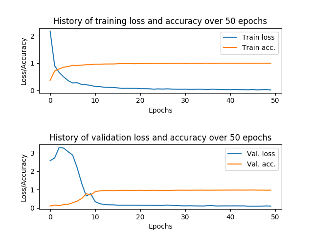

## Sign languages digits recognition with CNN

A simple Convolutional Neural Network (CNN) model is trained and used to infer the correct digit from a set of images that encode the decimal numbers in the range 0-9 in hand sign language. 

The dataset used for training/inference is available [here](https://www.kaggle.com/ardamavi/sign-language-digits-dataset). The CNN architecture used is the [SmallVGGNet](https://www.pyimagesearch.com/2018/09/10/keras-tutorial-how-to-get-started-with-keras-deep-learning-and-python/), a smaller version of the VGGNet. 

### Sample images for each digit
<table align="center">
 <tr>
  <th>0</th>
  <th>1</th>
  <th>2</th>
  <th>3</th>
  <th>4</th>
 </tr>
 <tr>
  <td></td>
  <td></td>
  <td></td>
  <td></td>
  <td></td>
 </tr>
 <tr>
 <tr>
  <th>5</th>
  <th>6</th>
  <th>7</th>
  <th>8</th>
  <th>9</th>
 </tr>
  <td></td>
  <td></td>
  <td></td>
  <td></td>
  <td></td>
 </tr>
</table>

### Training and validation metrics

  

